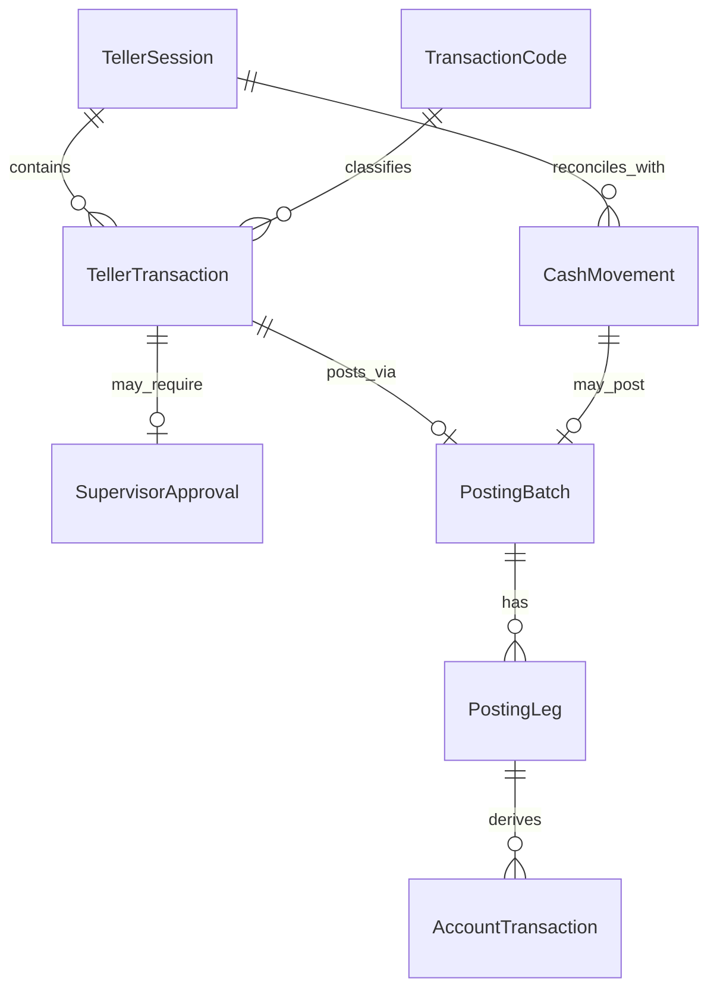
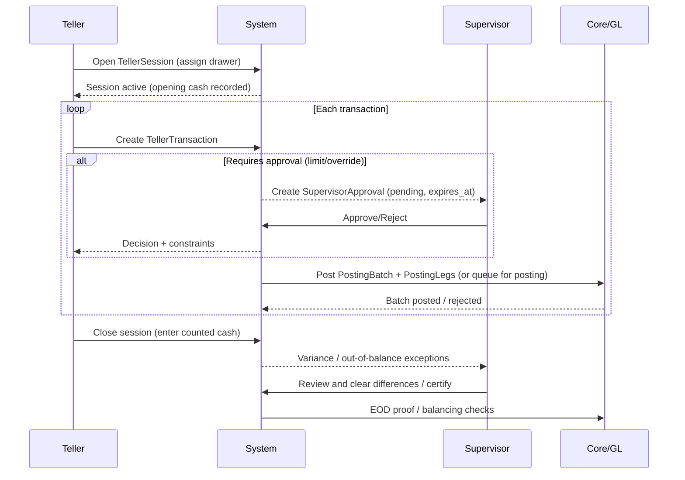

# Role-Based Branch Activity Reporting for Tellers, Teller Supervisors, and Branch Managers

## Executive summary

Branch-activity reporting works best when it is structured around **cash control, approvals, and double-entry posting**: (1) tellers need immediate visibility into a **single drawer/session** (expected vs counted cash, pending approvals, and transaction completion state), (2) teller supervisors need **exception and approval throughput** (override queue SLAs, over/short trends, and reversal controls), and (3) branch managers need **aggregate performance and exposure** (branch cash position, transaction mix, and operational risk indicators). This aligns with bank supervisory expectations for **strong internal controls, segregation of duties, and management reporting** over operational risk. citeturn2search0turn2search32turn2search16turn6search25

Regulatory-driven reporting, particularly for cash activity, is a non-negotiable overlay. In the United States, banks must file **Currency Transaction Reports (CTRs)** for currency transactions over **$10,000**, including where multiple currency transactions must be **aggregated** when the bank has knowledge they are “by or on behalf of” the same person, and CTR filing is electronic with specific timing expectations. citeturn0search1turn0search4turn0search11turn4search20turn4search2

Similarly, **Suspicious Activity Reports (SARs)** and supporting investigations imply strict **confidentiality / anti–tipping-off** controls: branch dashboards should expose only “need-to-operate” AML flags to front-line staff while restricting SAR existence and filing details to authorized compliance roles. citeturn5search1turn5search15turn5search19

From vendor evidence, modern teller platforms and cores commonly ship with predefined reporting families that map closely to the above role split: e.g., teller totals and productivity/time analysis, cash in/out, cash short/over, currency transaction/BSA reports, and dedicated teller-override reporting. citeturn1search3turn1search1turn1search9

A pragmatic rollout is to deliver a **Phase 1 “control MVP”** (real-time session/drawer dashboard, approval queue, over/short and reversal logs, daily branch proof), then add **Phase 2 operational performance** (productivity/time analysis, transaction mix, fee/waiver analytics), and finally **Phase 3 advanced analytics** (anomaly detection, cross-branch risk scoring, AML-support pattern dashboards). This sequencing reflects supervisory emphasis on control environment first, then broader operational risk monitoring and reporting. citeturn2search0turn2search32turn0search10

## Scope and assumptions

This report assumes a mid-sized retail bank or credit union branch network using a core/ledger that supports **double-entry posting to the general ledger** with end-of-day (EOD) proof controls and branch/teller balancing (common in core platforms). citeturn1search9turn6search25

Jurisdictional framing:
- Primary detail is **U.S.-centric** (FinCEN/FDIC/FFIEC/OCC guidance is the most explicit on CTR/SAR, aggregation, and BSA e-filing). citeturn0search4turn0search11turn4search2turn5search1  
- For EU applicability, the report notes that EU AML law requires reporting suspicious transactions and includes anti–tipping-off concepts, and EU supervisory guidance also stresses ICT controls like access control and logging. citeturn2search23turn3search1turn3search3

Technology assumptions (to support mapping):
- Typical operational tables exist: **TellerSession, TellerTransaction, PostingBatch, PostingLeg, AccountTransaction, CashMovement, SupervisorApproval, TransactionCode** (names are canonicalized).  
- Additional master data (Branch, Employee/User, Customer/Party, GLAccount) is required in practice, especially for BSA/AML filing, but is referenced only where critical. citeturn0search4turn4search5turn5search0

Date context: March 1, 2026 (America/Detroit).

## Role-specific dashboards and reports

The sections below define (a) what each role must accomplish, (b) the minimum dashboards/reports to do it well, and (c) how each artifact maps to the canonical tables and data elements.

### Cross-role comparison of core artifacts

The matrix below shows the most common “branch activity” artifacts and who should consume them (not who produces them).

| Artifact (dashboard/report) | Teller | Teller supervisor | Branch manager | Typical update |
|---|---:|---:|---:|---|
| Session/drawer status & expected cash | Primary | Secondary | Rare (aggregate only) | Real-time |
| Approval/override queue with SLA timers | Secondary (own items) | Primary | Secondary (KPIs only) | Real-time |
| Teller over/short + variance trend | Own only | Primary | Primary (summary) | EOD + daily |
| Reversal/void log with reasons and approver | Own only | Primary | Primary (summary) | Real-time + EOD |
| Daily branch proof / cash proof to GL | Not typical | Secondary | Primary | EOD |
| Transaction mix & productivity (by hour/day) | Self-coaching | Scheduling | Primary | Hourly/daily |
| Currency transaction (CTR) aggregation support | Operational prompt only | Escalation | Compliance/manager summary | Near real-time + daily |
| Audit/access and privilege change logs | No | Limited | Limited | Daily/weekly |

This role split matches common vendor report catalogs (teller totals/productivity/time analysis; cash short/over; currency transaction/BSA reports; and dedicated override reports) and supervisory expectations for control monitoring and reporting. citeturn1search3turn1search1turn2search32turn6search25

image_group{"layout":"carousel","aspect_ratio":"16:9","query":["bank teller workstation screen cash drawer balancing","teller over short report example","bank branch operations dashboard approvals queue","branch banker daily proof cash proof report"]}

### Teller

Teller reporting is about **completing work safely**: keeping their drawer in control, minimizing rework (reversals), and ensuring anything requiring approval is surfaced before the customer leaves. (Many teller platforms explicitly emphasize **teller-line balancing** and teller totals/productivity reporting.) citeturn1search5turn1search3turn6search25

#### Teller deliverables

| Teller artifact | Purpose | Required KPIs/metrics | Canonical sources and data elements | Update | Access/permissions | Visualization suggestions |
|---|---|---|---|---|---|---|
| Session control dashboard | Prevent out-of-balance close; keep drawer within limits | expected cash, net cash in/out, checks in/out, fee totals, transaction count, pending approvals, reversal count | TellerSession(session_id,teller_id,branch_id,opened_at,closed_at,status,opening_cash_amount,closing_expected_cash_amount,counted_cash_amount,over_short_amount); CashMovement(amount,instrument_type,from_location,to_location,related_session_id,initiated_at); TellerTransaction(amount,transaction_code_id,status,created_at,reversed_of_id); SupervisorApproval(status,expires_at) | Real-time | Teller sees only own sessions; no access to other tellers | Tile KPIs; “expected vs counted” gauge; red/amber/green variance |
| “My pending approvals” panel | Reduce abandoned/held transactions | pending approvals count, time-to-expiry, approval outcomes | SupervisorApproval(approval_id,request_type,requested_by,branch_id,status,requested_at,expires_at); TellerTransaction(approval_id,amount,transaction_code_id) | Real-time | Teller sees approval status only (not approver notes) | Queue with countdown timers |
| Teller session close report (printable) | Audit trail of balancing | opening cash, cash in/out, expected close, counted close, over/short, transfers, checks totals | TellerSession + CashMovement + TellerTransaction summaries; optional PostingBatch(posted_at,business_date) | EOD / session close | Requires attestation; immutable after close | Printable reconciliation statement with signatures |
| Teller totals report | Single session/day totals by category | totals by TransactionCode category; fee totals; cash vs non-cash totals | TellerTransaction(transaction_code_id,amount,fee_amount,currency,status); TransactionCode(category,affects_cash,fee_code) | EOD + daily | Teller sees own totals | Simple grouped bars; category totals table |
| Reversal/void self-review | Reduce repeat errors | reversals count, reversal reasons, time between original and reversal | TellerTransaction(reversed_of_id,reversal_reason,created_at); SupervisorApproval(decided_at,decision_reason) | Real-time + EOD | Teller sees own reversals; limited reason taxonomy | Annotated event list with “why” tags |
| Cash limit / exposure alerts | Keep within policy (limits vary by bank) | current cash vs drawer limit; large cash threshold flags | TellerSession(current_expected_cash); policy thresholds; TransactionCode(affects_cash) | Real-time | Teller sees their own limit only | Threshold line + alert banners |

These teller-facing artifacts are consistent with examiner expectations that teller cash is limited, checked daily, and that tellers complete daily proof/balancing records; and with vendor report families that include teller totals, cash in/out, time analysis, and cash short/over. citeturn6search25turn1search3turn1search5

### Teller supervisor

Supervisor reporting is about **control execution in-flight**: approving exceptions, monitoring teller differences, and ensuring reversals/overrides are not abused. Many cores explicitly define differentiated teller/supervisor levels of authority and ship dedicated override/override reporting. citeturn6search16turn1search1turn2search14

#### Supervisor deliverables

| Supervisor artifact | Purpose | Required KPIs/metrics | Canonical sources and data elements | Update | Access/permissions | Visualization suggestions |
|---|---|---|---|---|---|---|
| Branch teller grid (live) | Supervise multiple drawers in parallel | per teller: status, expected cash, txns/hour, pending approvals, reversals, variance | TellerSession(teller_id,status,opened_at,current_expected_cash,over_short_amount); TellerTransaction(count,amount); SupervisorApproval(pending_count) | Real-time | Sees all tellers in branch; not cross-branch by default | Sortable grid + conditional formatting |
| Approval/override queue (with SLAs) | Fast, consistent approvals | approval backlog, avg time-to-decision, % rejected, % expired | SupervisorApproval(request_type,status,requested_at,decided_at,expires_at,approver_id); TellerTransaction(amount,transaction_code_id) | Real-time | Approver notes restricted; audit-logged actions | FIFO queue + SLA timer + filters by risk |
| Over/short report (printable) | Daily balancing integrity | over/short per teller per day; variance trend | TellerSession(over_short_amount,business_date,closed_at); optional audit/trend table | EOD + daily | Supervisor views all; branch manager gets summary | Small multiples trend lines; outliers highlighted |
| Reversal/void and adjustments log | Detect abuse and training needs | reversal rate, adjustment totals, reasons frequency | TellerTransaction(reversed_of_id,adjustment_flag,reversal_reason,created_at); SupervisorApproval(decision_reason) | Real-time + EOD | Full detail; immutable audit export | Event timeline; Pareto chart of reasons |
| Teller override report (printable/audit) | Prove override usage; audit response prompts | override count and details by teller/type | SupervisorApproval(request_type=override,requested_by,approver_id,decided_at); plus any system “override message” log | Daily/weekly | Restricted to supervisory and audit roles | Detail report; heatmap by hour |
| Cash transfer control view | Ensure vault/drawer transfers are authorized and reconciled | transfers count/amount; pending completion; dual-control confirmations | CashMovement(from_location,to_location,instrument_type,amount,initiated_by,approved_by,completed_at,status) | Near real-time + EOD | Requires segregation of duties (maker-checker) | Sankey-style flow or simple in/out table |

This set aligns with supervisory expectations for segregation of duties and management oversight of internal controls and operational risk, and with vendor functionality emphasizing override governance and teller balancing controls. citeturn2search0turn0search10turn1search1turn6search25

### Branch manager

Branch managers require reporting that connects branch activity to **service performance, cash exposure, and control health**: daily proof to GL, staffing decisions (traffic and productivity), and risk signals (overrides, reversals, over/short trends). Core platforms frequently emphasize automated balancing to general ledger and daily “in-balance” reporting, and teller platforms market branch productivity and time analysis to executives. citeturn1search9turn1search3turn2search32

#### Branch manager deliverables

| Branch manager artifact | Purpose | Required KPIs/metrics | Canonical sources and data elements | Update | Access/permissions | Visualization suggestions |
|---|---|---|---|---|---|---|
| Daily branch proof / cash proof (printable) | Operational + financial close | total drawer cash, vault cash, in-transit, net cash in/out; out-of-balance items | TellerSession(closing_expected_cash,counted_cash,over_short); CashMovement(vault/drawer/in-transit); PostingBatch(business_date,status); PostingLeg(debit_credit,amount,gl_account_id) | EOD | Manager + accounting; immutable archive | Reconciliation statement + exception appendix |
| Branch cash position dashboard | Liquidity/exposure control | current cash on hand by location; policy limits; cash shipment needs | CashMovement + TellerSession current expected; optional GL cash accounts in PostingLeg | Real-time + hourly | No customer detail needed | Stacked bars by location; threshold overlays |
| Branch throughput & staffing dashboard | Decide staffing, reduce wait | txns/hour, peak hours, avg handling time proxy, mix by TransactionCode | TellerTransaction(created_at,transaction_code_id,amount); TransactionCode(category) | Hourly + daily | Aggregate only; no PII | Hourly line chart; stacked area by category |
| Branch control health scorecard | Governance and culture | overrides per 100 txns, reversals %, over/short frequency, approval SLA breaches | SupervisorApproval(decided_at,expires_at,status); TellerSession(over_short); TellerTransaction(reversed_of_id) | Daily + weekly | Manager sees aggregate; drill-down restricted | KPI tiles + trend lines; drill-down gates |
| Fee income and waivers summary | Revenue integrity | fee totals by type; manual fee waivers/overrides | TellerTransaction(fee_amount,fee_code,transaction_code_id); TransactionCode(fee_code,requires_approval) | Daily/weekly | Requires policy-based access; sensitive | Bars by fee type; variance vs baseline |
| BSA/AML operational prompts (limited) | Ensure escalation without tipping-off | large cash flags count; CTR “possible aggregation” flags; holds for compliance review | TellerTransaction(amount,cash_amount,transaction_code_id,party_id); AML flags table (outside scope) | Near real-time + daily | Do not expose SAR existence; compliance-only detail | “Escalate to compliance” counters only |

The “branch proof to GL” emphasis is consistent with core platforms advertising automated daily GL balancing and “in-balance” proofs, and with supervisory guidance that management reporting and internal controls safeguard assets and detect deficiencies. citeturn1search9turn0search10turn2search32turn6search25

## Universal and regulatory reporting

Universal reports are those that (a) enable **auditability and reproducibility** of branch activity from transaction and posting records, and/or (b) satisfy explicit regulatory reporting/recordkeeping requirements.

### Regulatory-driven reports and views

In the U.S., core BSA obligations drive several reporting views that touch branch activity: CTR threshold reporting (> $10,000 in currency), aggregation of multiple related currency transactions, identity verification for reportable currency transactions, and electronic filing timelines; recordkeeping for monetary instrument sales ($3,000–$10,000 in currency); and funds transfer recordkeeping (“Travel Rule” frameworks) as applicable. citeturn0search1turn0search4turn0search11turn4search5turn4search16turn4search20turn4search2

In the EU, suspicious transaction reporting is required (including attempted transactions) and firms and staff must avoid “tipping off” customers about reports; EU guidance also sets expectations for ICT security controls such as logging and monitoring privileged activities. citeturn2search23turn3search1turn3search3

### Universal report inventory

| Universal artifact | Driver | Audience/owner | Key data sources and elements | Frequency |
|---|---|---|---|---|
| Posting integrity / balanced batch report | Financial integrity | Accounting + audit | PostingBatch(batch_id,status,business_date,posted_at); PostingLeg(batch_id,debit_credit,amount,gl_account_id) | EOD |
| Branch proof / in-balance exception list | Cash control + GL | Branch manager + operations | TellerSession(over_short,status); CashMovement(status); PostingBatch out-of-balance indicators | EOD |
| CTR support: “cash > $10k” candidate list with aggregation | U.S. BSA | Compliance + BSA ops | TellerTransaction(currency,cash_amount,party_id,business_date); cross-branch aggregation keys; plus Party KYC fields | Near real-time + daily | 
| Monetary instrument sales record (cash $3k–$10k) | U.S. BSA recordkeeping | Operations + compliance | TellerTransaction(transaction_code indicates instrument sale, amount, party_id); instrument serial numbers (often separate table) | Daily |
| SAR case management and confidentiality controls | U.S. BSA + safety | Compliance only | SAR workflow tables; strict access logs; linkage to TellerTransaction by case | Daily/weekly |
| “Approvals and overrides” audit pack | Internal control | Audit + risk | SupervisorApproval(request_type,status,requested_by,approver_id,decided_at); link to TellerTransaction | Daily/weekly |
| Access and privilege change report | Security/IT control | IT security + audit | user-role grants; login resets; “viewed/exported report” events; retention | Daily/weekly |

SAR confidentiality is a specific permission design constraint: U.S. guidance and rules prohibit disclosing SAR existence to the subject, and systems should be designed so branch staff do not inadvertently view SAR filing status through dashboards or report exports. citeturn5search1turn5search15turn5search19

## Data model mapping, queries, and flows

### Minimum data elements by canonical table

The table below defines a practical “minimum viable” schema to support the dashboards and audit reports above (field names are representative).

| Table | Minimum data elements needed for reporting |
|---|---|
| TellerSession | session_id, teller_id, branch_id, drawer_id, opened_at, closed_at, business_date, status, opening_cash_amount, closing_expected_cash_amount, counted_cash_amount, over_short_amount |
| TellerTransaction | teller_txn_id, session_id, branch_id, created_at, transaction_code_id, amount_total, cash_amount, noncash_amount, fee_amount, currency, status(posted/voided/reversed/pending), reversed_of_id, approval_id(nullable), customer_account_id(nullable), party_id(nullable) |
| TransactionCode | transaction_code_id, name, category(deposit/withdrawal/fee/etc.), affects_cash(bool), requires_approval(bool), default_gl_map_id |
| SupervisorApproval | approval_id, branch_id, request_type(override/limit/bypass/etc.), requested_by, requested_at, expires_at, status(pending/approved/rejected/expired), approver_id, decided_at, decision_reason_code |
| CashMovement | movement_id, branch_id, initiated_at, completed_at, status, instrument_type(cash/coin/check), amount, from_location(drawer/vault/atm/in_transit), to_location, initiated_by, approved_by(nullable), related_session_id(nullable), reason_code |
| PostingBatch | posting_batch_id, business_date, posted_at, status(open/posted/reversed), source_system, created_by |
| PostingLeg | posting_leg_id, posting_batch_id, gl_account_id, debit_credit, amount, currency, memo, source_teller_txn_id(nullable) |
| AccountTransaction | account_txn_id, customer_account_id, posting_leg_id, amount, debit_credit, value_date, posted_at, description |

Using a **single posting truth** (PostingBatch/PostingLeg) matches core platform emphasis on proving in-balance accounts and supporting daily proof reporting, and supports auditor expectations for reconstructing transaction flows. citeturn1search9turn2search32turn0search10

### Mermaid diagram: data model relationships



### Sample SQL / pseudocode for key aggregates

#### Session totals (expected cash position, by session)

```sql
-- Expected cash = opening cash + net cash movements affecting the drawer
-- (Assumes CashMovement records transfers to/from the drawer)
SELECT
  s.session_id,
  s.teller_id,
  s.branch_id,
  s.opened_at,
  s.closed_at,
  s.opening_cash_amount,
  COALESCE(SUM(CASE
    WHEN m.to_location = 'drawer' THEN m.amount
    WHEN m.from_location = 'drawer' THEN -m.amount
    ELSE 0
  END), 0) AS net_cash_moves,
  (s.opening_cash_amount
   + COALESCE(SUM(CASE
      WHEN m.to_location = 'drawer' THEN m.amount
      WHEN m.from_location = 'drawer' THEN -m.amount
      ELSE 0
     END), 0)
  ) AS expected_cash_amount
FROM TellerSession s
LEFT JOIN CashMovement m
  ON m.related_session_id = s.session_id
 AND m.status = 'completed'
 AND m.instrument_type IN ('cash','coin')
GROUP BY 1,2,3,4,5,6;
```

#### Over/short (computed vs stored)

```sql
SELECT
  s.session_id,
  s.teller_id,
  s.branch_id,
  s.business_date,
  s.counted_cash_amount,
  s.closing_expected_cash_amount,
  (s.counted_cash_amount - s.closing_expected_cash_amount) AS computed_over_short
FROM TellerSession s
WHERE s.status = 'closed';
```

#### Approval metrics (SLA, backlog, and decision speed)

```sql
SELECT
  a.branch_id,
  a.request_type,
  COUNT(*) FILTER (WHERE a.status = 'pending') AS pending_count,
  AVG(EXTRACT(EPOCH FROM (a.decided_at - a.requested_at)))
    FILTER (WHERE a.status IN ('approved','rejected')) AS avg_decision_seconds,
  COUNT(*) FILTER (WHERE a.status = 'expired') AS expired_count
FROM SupervisorApproval a
WHERE a.requested_at >= NOW() - INTERVAL '7 days'
GROUP BY 1,2;
```

#### Override rate per teller (per 100 transactions)

```sql
SELECT
  t.teller_id,
  DATE_TRUNC('day', t.created_at) AS day,
  100.0 * COUNT(*) FILTER (WHERE a.request_type = 'override'
                           AND a.status = 'approved')
        / NULLIF(COUNT(*), 0) AS overrides_per_100_txn
FROM TellerTransaction t
LEFT JOIN SupervisorApproval a ON a.approval_id = t.approval_id
WHERE t.created_at >= NOW() - INTERVAL '30 days'
  AND t.status IN ('posted','reversed','voided')
GROUP BY 1,2;
```

### Mermaid diagram: session lifecycle and approval flow



## Phased MVP rollout and governance

### Phased rollout plan

| Phase | Goal | Dashboards/reports shipped | Notes on dependencies |
|---|---|---|---|
| Phase 1: Control MVP | Make the branch balance reliably | Teller session control dashboard; supervisor approval queue; session close report; over/short report; reversal/void log; daily branch proof; posting batch integrity report | Requires clean linking: TellerTransaction → PostingBatch/PostingLeg; CashMovement tracked as first-class events; immutable close artifacts citeturn6search25turn1search9 |
| Phase 2: Operational performance | Improve staffing and productivity | Transaction mix & peak hour dashboards; teller productivity/time analysis; fee and waiver summaries; branch cash exposure trends | Vendor report families commonly include time analysis, teller productivity, and branch productivity-like reporting citeturn1search3 |
| Phase 3: Advanced analytics | Reduce risk and drive proactive management | Outlier detection (unusual reversals/overrides); cross-branch variance patterns; predictive cash needs; AML-support pattern dashboards (without SAR leakage) | Must preserve segregation of duties and confidentiality; align to operational risk principles and AML confidentiality constraints citeturn2search0turn5search1turn3search1 |

### Access, logging, and auditability requirements

Role-based access control and logging are foundational: regulators and supervisors emphasize access controls (including role-based access and segregation of duties), and expectations for logging/monitoring privileged or exceptional activities are explicit in both U.S. and EU supervisory guidance. citeturn0search6turn0search21turn3search1

A minimal permission model should enforce:
- Teller: read/write only within own session; see approval “status” but not sensitive rationale.
- Supervisor: branch-level session visibility; can decide approvals; cannot edit posted ledger.
- Branch manager: branch-level aggregates; drill-down gated; cannot approve own activity.
- Compliance/audit (outside the three roles): access to CTR/SAR work queues and confidential case artifacts with strict logging and export controls. citeturn2search0turn0search10turn5search1turn3search1

## Prioritized sources

Regulator and supervisory guidance (primary)
- FFIEC BSA/AML Manual — Currency Transaction Reporting (CTR requirements, aggregation concepts, recordkeeping context). citeturn0search4turn0search8  
- 31 CFR § 1010.311 (CTR filing obligation, >$10,000 currency). citeturn0search1  
- FDIC Risk Management Manual / FIL on CTR aggregation across branches (explicit aggregation statement). citeturn0search11turn0search12  
- FinCEN Mandatory BSA E-Filing (CTR/SAR e-filing mandate timing). citeturn4search2turn4search17  
- FinCEN SAR confidentiality guidance (prohibition on disclosing SAR existence). citeturn5search1turn5search19  
- OCC Comptroller’s Handbook: Cash Accounts and Internal Control (teller limits, daily proof, segregation/dual-control principles). citeturn6search25turn0search10  
- Basel Committee principles for operational risk and internal controls (management reporting, separation of duties). citeturn2search0turn2search32  
- EU AML Directive (Directive (EU) 2015/849) (suspicious transaction reporting, anti–tipping-off framing). citeturn2search23turn5search13  
- EBA Guidelines on ICT and security risk management (logging of privileged activities; access control expectations). citeturn3search1turn3search5  
- ECB Banking Supervision commentary on IT risk reporting as a supervisory input (context for ICT reporting expectations). citeturn3search3  

Vendor documentation (primary/near-primary)
- entity["company","Fiserv","fintech vendor"] Integrated Teller brochure (examples of predefined teller/branch reporting: teller totals, productivity/time analysis, cash short/over, currency transaction/BSA report). citeturn1search3turn1search7  
- Fidelity Information Services / FIS Horizon bookshelf docs (example of dedicated teller override report and override governance concepts). citeturn1search1turn6search16  
- FIS Horizon Banking System brochure (automated GL balancing and daily proof/out-of-balance reporting concept). citeturn1search9  
- Jack Henry developer documentation: Teller transaction APIs and CTR/excessive cash reporting references (evidence of CTR-related “batch program”/cash report concepts tied to GL codes). citeturn6search30turn6search2