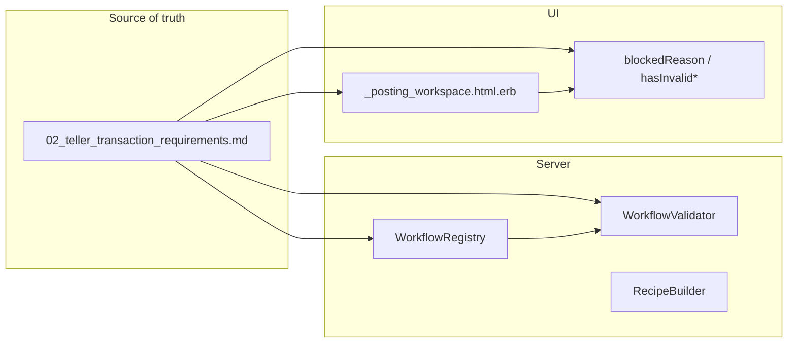

# Teller transaction types — required and optional fields

**Status:** Source of truth for teller transaction input requirements.  
**Audience:** Product, QA, and implementation. When adding or changing transaction types or required fields, update this doc first, then align WorkflowRegistry, WorkflowValidator, RecipeBuilder, and the posting form.

Implementation references:

- Server: [app/services/teller/workflow_registry.rb](../app/services/teller/workflow_registry.rb), [app/services/posting/workflow_validator.rb](../app/services/posting/workflow_validator.rb), [app/services/posting/recipe_builder.rb](../app/services/posting/recipe_builder.rb)
- UI: [app/views/teller/dashboard/_posting_workspace.html.erb](../app/views/teller/dashboard/_posting_workspace.html.erb), [app/javascript/controllers/posting_form_controller.js](../app/javascript/controllers/posting_form_controller.js)

---

## Deposit

**Purpose:** Accept funds into a customer account (cash and/or checks).

**Required (server):**

- `primary_account_reference` — customer account to credit
- `amount_cents` > 0 — effective total (must equal cash + check subtotal; at least one of cash > 0 or check items with amount > 0)
- `entries` — balanced legs (client sends explicit entries: debits = cash account + check account refs, credit = primary)

**Conditional:**

- If check rows with amount > 0 are sent: each such row should include routing, account, number for a valid check account reference; server accepts explicit entries and optional `check_items` metadata. UI blocks Post if a check row has amount > 0 but any of routing/account/number is missing.

**Optional (stored in metadata when check items present):**

- `check_items[]`: routing, account, number, account_reference, amount_cents, hold_reason, hold_until

**Posting:** Debit cash account (and/or check account refs), credit primary account; total debits = total credits = effective amount.

---

## Withdrawal

**Purpose:** Pay out cash from a customer account to the drawer.

**Required (server):**

- `primary_account_reference` — account to debit
- `amount_cents` > 0
- `entries` — balanced legs (debit primary, credit cash account)

**Optional:** None beyond request_id, transaction_type, currency.

**Posting:** Debit primary account, credit cash account (drawer).

---

## Transfer

**Purpose:** Move funds from one account to another (no cash).

**Required (server):**

- `primary_account_reference` — "from" account (when entries not pre-filled)
- `counterparty_account_reference` — "to" account (when entries not pre-filled)
- `amount_cents` > 0
- `entries` — balanced legs (debit primary, credit counterparty)

**Conditional:** WorkflowValidator only requires primary and counterparty when `entries` are blank; normally the client sends explicit entries.

**Optional:** None.

**Posting:** Debit primary account, credit counterparty account.

---

## Check cashing

**Purpose:** Cash a check: receive check (settlement), pay out net cash (and optional fee).

**Required (server):**

- `check_amount_cents` > 0
- `settlement_account_reference` — account to debit for the check
- `id_type` — presenter ID type (e.g. drivers_license, passport)
- `id_number` — presenter ID number
- `amount_cents` = net cash payout (check_amount_cents − fee_cents); must be positive
- `entries` — balanced legs (debit settlement, credit cash for net payout; if fee > 0, credit fee income)

**Conditional:**

- fee_cents >= 0 and fee_cents <= check_amount_cents (net payout positive)

**Optional (stored in metadata):**

- check_number, routing_number, account_number, payer_name, presenter_type, fee_income_account_reference

**Posting:** Debit settlement account (check amount); credit cash account (net payout); if fee > 0, credit fee income account.

---

## Draft (bank draft)

**Purpose:** Issue an official bank draft funded by customer account or cash.

**Required (server):**

- `draft_amount_cents` > 0
- `draft_payee_name`
- `draft_instrument_number`
- `draft_liability_account_reference` (validated in :validate mode; default `official_check:outstanding` is sent by form)
- Funding: if `draft_funding_source` = "cash" then `cash_account_reference` required; else `primary_account_reference` required
- `amount_cents` — effective amount used for posting flow (draft amount)
- `entries` — balanced legs (debit funding source, credit liability; optional fee legs)

**Conditional:**

- draft_fee_cents >= 0 (if > 0, additional debit to funding and credit to fee income)

**Optional (stored in metadata):**

- draft_fee_income_account_reference (default income:draft_fee)

**Posting:** Debit funding (cash or primary account), credit draft liability account; if fee > 0, debit funding and credit fee income.

---

## Vault transfer

**Purpose:** Move cash between drawer and vault(s).

**Required (server):**

- `vault_transfer_direction` — one of drawer_to_vault, vault_to_drawer, vault_to_vault
- `vault_transfer_reason_code` — non-blank
- `vault_transfer_memo` — required when reason_code = "other"
- Source/destination by direction:
  - drawer_to_vault: destination (vault) required
  - vault_to_drawer: source (vault) required
  - vault_to_vault: both source and destination required
- `amount_cents` > 0
- `entries` — balanced legs (debit destination cash account, credit source cash account)

**Optional (stored in metadata):**

- reason_code, memo (always stored)

**Posting:** Debit destination cash account, credit source cash account (drawer or vault refs).

---

## Summary table (required by server)

| Type           | Required fields (min to pass validation / build entries) |
|----------------|----------------------------------------------------------|
| Deposit        | primary_account_reference, amount_cents > 0, balanced entries (cash and/or checks) |
| Withdrawal     | primary_account_reference, amount_cents > 0, entries    |
| Transfer       | primary_account_reference, counterparty_account_reference, amount_cents > 0, entries (or validator applies when entries blank) |
| Check cashing  | check_amount_cents > 0, settlement_account_reference, id_type, id_number, amount_cents = net payout > 0, entries |
| Draft          | draft_amount_cents > 0, draft_payee_name, draft_instrument_number, draft_liability_account_reference; + (cash_account_reference if funding=cash) or primary_account_reference; entries |
| Vault transfer | vault_transfer_direction, vault_transfer_reason_code, memo if reason=other, source/dest refs by direction, amount_cents > 0, entries |

---

## How requirements flow (reference)

---

## Form vs requirements (audit)

Use this section to record gaps between the requirements above and the current form/UI. Update when implementation or requirements change.

### Deposit

- **Form exposes:** Transaction type, cash amount, primary account, counterparty (hidden), cash account (hidden when fixed flow), check section (Add check rows: routing, account, number, amount, hold reason/until).
- **Form submits:** entries, primary_account_reference, amount_cents, cash_account_reference, check_items (when present).
- **UI blocks on:** primary missing, amount <= 0, invalid check rows (amount > 0 but routing/account/number incomplete), unbalanced entries.
- **Gaps:** None; required fields are present and submitted.

### Withdrawal

- **Form exposes:** Cash amount, primary account.
- **Form submits:** entries, primary_account_reference, amount_cents, cash_account_reference.
- **UI blocks on:** primary missing, amount <= 0, unbalanced.
- **Gaps:** None.

### Transfer

- **Form exposes:** Cash amount, primary account, counterparty account.
- **Form submits:** entries, primary_account_reference, counterparty_account_reference, amount_cents.
- **UI blocks on:** primary or counterparty missing, amount <= 0, unbalanced.
- **Gaps:** None.

### Check cashing

- **Form exposes:** Check amount, fee, settlement account, check number, payer name, routing/account number, presenter type, id_type, id_number.
- **Form submits:** All of the above plus fee_income_account_reference; entries.
- **UI blocks on:** check amount <= 0, fee < 0, net payout <= 0, settlement account blank, id_type blank, id_number blank.
- **Gaps:** None; required fields (including id_type, id_number) are validated by server and UI.

### Draft

- **Form exposes:** Funding source, draft amount, draft fee, payee, instrument number; liability and fee income refs (hidden with defaults).
- **Form submits:** draft_funding_source, draft_amount_cents, draft_fee_cents, draft_payee_name, draft_instrument_number, draft_liability_account_reference, draft_fee_income_account_reference, primary_account_reference, cash_account_reference, entries.
- **UI blocks on:** draft amount <= 0 or fee < 0, or (when draft section required) missing payee, instrument number, or liability account; missing funding (primary or cash); unbalanced.
- **Gaps:** None; liability account has default and is submitted.

### Vault transfer

- **Form exposes:** Direction, reason code, memo; source/destination vault selects (visibility by direction); "vault counterparty" select for drawer_to_vault / vault_to_drawer.
- **Form submits:** vault_transfer_direction, vault_transfer_source_cash_account_reference, vault_transfer_destination_cash_account_reference, vault_transfer_reason_code, vault_transfer_memo, entries.
- **UI blocks on:** direction/reason/memo (when other) missing, or vault endpoints invalid or missing for direction; unbalanced.
- **Gaps:** None. (Vault transfer uses a single "counterparty" select for drawer↔vault and maps it to source or destination in vaultTransferDetails(); vault_to_vault uses separate source/dest. Ensure submitted refs match what RecipeBuilder expects.)

---

## Requirements going forward

- **Ownership:** This document is the contract for required/optional fields per transaction type. When adding a new transaction type or changing what is required, update this doc first, then:
  - WorkflowRegistry (required_fields, policies)
  - WorkflowValidator (case logic)
  - RecipeBuilder / metadata as needed
  - Posting form (sections, inputs, buildFormDataFromState / append*)
  - posting_form_controller blockedReason and hasInvalid* so UI blocking matches the doc
- **Review:** In PRs that change required fields or add transaction types, require that this doc and the "Form vs requirements" audit are updated.
- **Before release:** Confirm WorkflowValidator and posting_form_controller blockedReason/hasInvalid* behavior match this document (and that no required field is missing from the form or submit).
